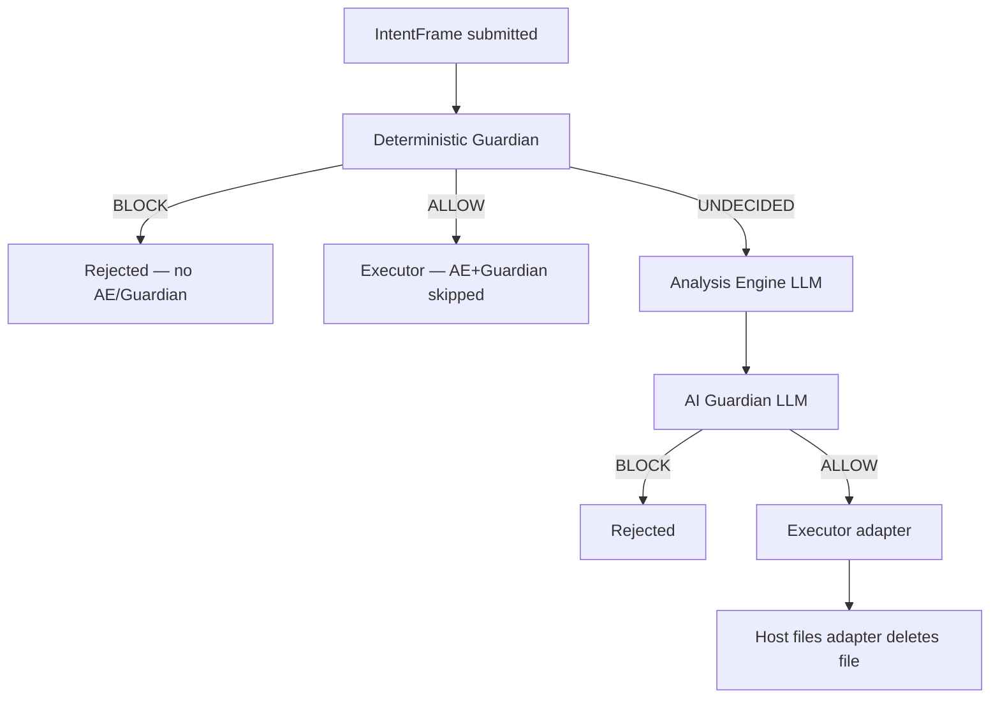

# DELETE_HOST_FILE validation in IntentFrame

This document explains how IntentFrame validates **`DELETE_HOST_FILE`** — the action type for deleting a real file on the host filesystem (as opposed to sandboxed `DELETE_FILE` in a virtual workspace).

It covers the full pipeline: policy layers, deterministic gates, semantic (LLM) evaluation, and what happens after ALLOW. It is **agent-agnostic** (Jarvis, Hermes, or any other actor that submits this action type).

---

## Action identity and payload contract

| Field | Role |
|-------|------|
| `intent.action` | Must be `"DELETE_HOST_FILE"` |
| `intent.data["path"]` | **Authoritative** path the executor deletes. All path policy checks use this field. |
| `intent.target` | Display / audit only. **Not** used for enforcement. |
| `intent.reason` | Agent narrative (untrusted). Used by AE/Guardian for semantic checks. |

`DELETE_HOST_FILE` is registered as:

- **Category:** `HOST_FILE` (host-files action bundle)
- **Critical domain:** `deletion` (deletion domain bundle)

See `action_registry/types.py` (`ACTION_DOMAINS`) and `domain_routes.py`.

The deletion domain intent slice (`DeletionIntentData`) requires:

```yaml
path: str          # required
irreversible: bool  # defaults true
```

---

## High-level pipeline

Every `DELETE_HOST_FILE` intent flows through IntentFrame server `pipeline.py`:



**Typical delete path today:** deterministic checks pass → **UNDECIDED** → AE tags **HIGH + IRREVERSIBLE** → Guardian **ALLOW or BLOCK** (fallback prompts; outcome is semantic, not fixed).

---

## Policy inputs (what configures validation)

Policy is loaded into the policy registry as `UserPolicy` for `(user_id, agent_id)`. Relevant sections:

### 1. `allowed_actions.DELETE_HOST_FILE` (required to run at all)

```yaml
allowed_actions:
  DELETE_HOST_FILE:
    safe: false          # almost always false for deletes
    constraints:
      allowed_host_paths:
        - "~/*"
```

| Field | Enforced by | Effect |
|-------|-------------|--------|
| Presence in `allowed_actions` | Deterministic Guardian (`permission` gate) | Missing → **BLOCK** |
| `safe: true` | AI Guardian fast-path | Would skip LLM only if AE reports **no** HIGH/CRITICAL risk, no hidden behaviors, no scope mismatch. Deletes almost never qualify because AE marks them HIGH. |
| `constraints.allowed_host_paths` | Host-files bundle `enforce_constraints` | Path must match patterns (fnmatch + canonicalization). Gate: `constraint`. |

**Path matching** uses `canonicalize_real_path()` and fnmatch in `HostFilesActionBundle._path_matches()`. Examples:

- `~/foo.txt` with `~/*` → **pass**
- `/etc/foo` with `~/*` → **BLOCK** (`Gate: constraint`)

### 2. `domain_constraints.deletion` (structural, deterministic)

```yaml
domain_constraints:
  deletion:
    allowed_paths: ["~/*"]       # optional; second path allowlist
    block_irreversible: false    # if true → BLOCK when irreversible (default data.irreversible=true)
    require_confirmation: true   # describe-only today — NOT enforced in code
```

Enforced by `DeletionDomainBundle.enforce()`:

| Field | Deterministic? | Notes |
|-------|----------------|-------|
| `allowed_paths` | **Yes** | Uses `data["path"]`. Gate: `domain`. Separate matching logic from action constraints (simpler fnmatch). |
| `block_irreversible` | **Yes** | Blocks when `data.get("irreversible", True)` is true. |
| `require_confirmation` | **No** | Appears in `describe()` / onboarding text only. Does not block or pause execution. |

### 3. `intent_limits` (semantic, LLM-only)

Cross-cutting rules evaluated by **AI Guardian**, not code:

```yaml
intent_limits:
  - limit_id: block-sensitive-home-delete
    domain: deletion
    description: Block deletes of credentials and sensitive home paths
    raw: "Never delete ~/.ssh, keychains, shell rc files, ..."
    effect: block
    scope: per_action

  - limit_id: allow-home-non-sensitive-delete
    domain: deletion
    description: Carefully allow ordinary home deletes that passed path checks
    raw: "Treat deletion as sensitive ... allow only when ..."
    effect: allow
    scope: per_action
```

Important semantics (from `SemanticIntentLimit` and Guardian prompt):

- Intent limits are **reference sheets for the LLM**, not a rules engine.
- Default Guardian instructions treat limits as **boundaries**: if domain matches and limit is **violated** → BLOCK.
- `effect: block` is the primary supported pattern.
- `effect: allow` is stored and shown to the model (`→ allow`) but **does not deterministically override** the fallback rule *“BLOCK if risk factors at HIGH or CRITICAL”*.
- There is no `effect: allow` code path that bypasses Guardian.

See `intentframe_core/policy.py` and `prompt_library/library/guardian.py`.

---

## Deterministic Guardian — hook order

`DeterministicRunner.run_action_bundle()` runs hooks in a fixed order for the **host_files** bundle:

1. **`prepare_evidence`** — For `DELETE_HOST_FILE`, no file-intel pre-pipeline (only `WRITE_HOST_FILE` runs `run_files_pre_pipeline`).
2. **`enrich`** — Optional target/data enrichment (must not terminal BLOCK/ALLOW).
3. **`enforce_constraints`** — `allowed_host_paths` check on `data["path"]`.
4. **`domain_enforce:deletion`** — Deletion domain schema + `domain_constraints.deletion`.
5. **`structural_gates`** — Deny-floor check (`decide_host_file_floor`).
6. **`allow_gates`** — Bundle-specific deterministic ALLOW (none for delete today).
7. If still alive → **UNDECIDED** + build AI context.

Permission check happens **before** the runner in `DeterministicGuardian._decide_inner()`.

### Deny floor (non-negotiable prefixes)

Even when `allowed_host_paths: ["~/*"]` matches, certain paths are **always blocked** deterministically via `match_deny_prefix()` (`resource_registry/floor.py`). Gate: `delete_host_file_floor`.

Categories include:

- System trees: `/System`, `/usr`, `/bin`, `/sbin`
- Persistence: LaunchAgents/Daemons, shell rc files (`~/.zshrc`, …)
- Secrets: `~/.ssh`, `~/.gnupg`
- Privilege configs: `/etc/sudoers*`, `/etc/sshd_config`, `/etc/pam.d`
- User content stores: `~/Library/Keychains`, `~/Library/Messages`, `~/Library/Mail`
- Product internals: `~/.intentframe`

This floor applies to host-file **mutations** (write + delete). It is symmetric with sandbox deny lists for `RUN_COMMAND` but enforced in the host-files bundle because file tools bypass the Seatbelt profile.

---

## AI path — Analysis Engine (AE)

Reached only when deterministic outcome is **UNDECIDED**.

### Prompt source for DELETE_HOST_FILE

`HostFilesActionBundle.build_ai_context()` returns **empty** `BundleAIContext` for deletes. Only `WRITE_HOST_FILE` gets custom AE instructions (`critical_write_file`).

Deletes therefore use **`fallback_default`** AE prompts (`DEFAULT_AE_SYSTEM_INSTRUCTIONS` in `prompt_library/library/analysis.py`).

Typical AE output for a benign home file delete:

| Field | Typical value |
|-------|----------------|
| `semantic_domains` | `["deletion"]` |
| `reversibility` | `IRREVERSIBLE` |
| `risk_factors.overall` | `HIGH` |
| `hidden_behaviors` | `[]` (if straightforward) |
| `scope_mismatch` | false |

AE is instructed to tag `DELETE_FILE` / delete actions with domain `deletion` and to assess risk from direct impact. Irreversible file removal is routinely classified HIGH.

---

## AI path — Guardian

Guardian runs when:

- Deterministic outcome was **UNDECIDED**, and
- Action is in `allowed_actions`, and
- Fast-path does **not** apply (`safe: true` **and** no risk flags).

For deletes, fast-path effectively never triggers because `_has_risk_flags()` returns true when any risk factor is HIGH or CRITICAL.

### Fallback Guardian rules (decisive today)

From `DEFAULT_GUARDIAN_SYSTEM_INSTRUCTIONS`:

- **BLOCK** if risk factors at **HIGH or CRITICAL**
- **BLOCK** on scope mismatch, hidden behaviors, phishing, etc.
- Intent limits: if domain matches and limit **violated** → BLOCK (cite `limit_id`)

Guardian also receives:

- Policy context (constraints already passed)
- **Intent Limits** section (if configured)
- Analysis report (trusted)
- Target / reason / data (untrusted, boundary-marked)

### Custom Guardian context for delete

Same gap as AE: `build_ai_context()` does **not** supply deletion-specific Guardian instructions. Deletes use fallback Guardian prompts.

**Observed behavior (2026):** ordinary `~/…` deletes that pass `allowed_host_paths` and deny floor reach AE + Guardian. Outcome is **not deterministic**:

- Guardian may **BLOCK** with reason along the lines of: *Analysis Report rates overall risk as HIGH — block actions with HIGH/CRITICAL risk factors.*
- Guardian may **ALLOW** when AE reports **MEDIUM** overall risk (still irreversible) and no other block triggers fire.

Positive `effect: allow` intent limits may appear in the prompt and onboarding guardrails, but they **do not reliably override** the HIGH-risk BLOCK rule without deletion-specific Guardian prompt guidance.

Integration tests treat ordinary `~/…` deletes as **semantic smoke** (valid ALLOW or BLOCK decision). Strict block assertions are reserved for deterministic floors (`/etc/…`, `~/.ssh/…`, etc.).

---

## Onboarding / handshake guardrails

On first agent handshake, IntentFrame may generate natural-language guardrails from policy (including `intent_limits` and constraint descriptions). These appear in logs as “AI-Generated Guardrails” and bias the LLM, but are **not** separate deterministic gates.

Deletion-related guardrails typically restate:

- Review deletes carefully
- Do not delete sensitive paths (`~/.ssh`, keychains, …)
- Stay within home directory scope

---

## After ALLOW — executor

If Guardian ALLOWs, the runtime invokes the executor pack’s **host files adapter** (`intentframe_executor_pack_macos/adapters/host_files.py`):

1. Re-checks deny floor (`match_deny_prefix`)
2. Performs the delete on the real filesystem

Validate-only deployments may stop after validation without executing; that is executor configuration, not a change to the validation pipeline above.

---

## Multi-intent submissions

Some agents map one tool call to **multiple** IntentFrames (e.g. V4A patch with Update + Delete). IntentFrame validates **each intent separately**. If any intent BLOCKs, the overall tool validation fails (fail-closed on the batch).

Example observed sequence for mixed write+delete under `~/` (when delete is blocked):

| Intent | Action | Result |
|--------|--------|--------|
| 1 | `WRITE_HOST_FILE` | ALLOW (LOW risk, write-specific AE context) |
| 2 | `DELETE_HOST_FILE` | BLOCK (HIGH + irreversible) |

When the delete intent is **ALLOW**d, the whole batch may succeed. When any intent **BLOCK**s, the overall tool validation fails (fail-closed on the batch).

---

## Decision matrix (quick reference)

| Scenario | Layer | Gate / reason |
|----------|-------|----------------|
| Action not in `allowed_actions` | Deterministic | `permission` |
| Path outside `allowed_host_paths` | Deterministic | `constraint` |
| Path outside `domain_constraints.deletion.allowed_paths` | Deterministic | `domain` |
| `block_irreversible: true` | Deterministic | `domain` |
| Path hits deny floor (e.g. `~/.ssh/…`) | Deterministic | `delete_host_file_floor` |
| Ordinary `~/foo.txt`, policy allows path | AE + Guardian | **ALLOW or BLOCK** (semantic; integration tests accept either) |
| Sensitive delete blocked by intent limit text | Guardian | `limit_violated` (LLM) |
| `safe: true` on delete | N/A | Does not help; AE marks HIGH → no fast-path |

---

## Debugging

IntentFrame server logs (`intentframe-server.log`) show each intent with phases:

```
DETERMINISTIC GUARDIAN: pre-AE pass   → Decision / Gate
ANALYSIS ENGINE                       → Reversibility, Domains, Risk factors
GUARDIAN                              → ALLOW or BLOCK + reason
```

Useful fields:

- `prompt=fallback_default:fallback_default` on delete → confirms no bundle-specific AE/Guardian prompts
- `Gate: constraint` → path policy (before LLM)
- `Gate: delete_host_file_floor` → deny floor
- `Gate: domain` → deletion domain constraints
- Guardian reason citing **HIGH** → fallback semantic rule, not deterministic path failure

---

## Policy authoring implications

1. **`allowed_host_paths` and `domain_constraints.deletion.allowed_paths`** are the deterministic scope knobs. They are checked in code, not by the LLM.
2. **Deny floor** protects sensitive paths even inside a broad `~/*` allowlist.
3. **`require_confirmation`** in deletion domain is documentation/onboarding only until implemented.
4. **`intent_limits`** add semantic BLOCK (and guidance text for ALLOW), but cannot alone make ordinary deletes pass while fallback Guardian blocks HIGH risk.
5. **`safe: false`** is correct for deletes; setting `safe: true` does not create a supported “always allow home deletes” fast path.
6. To allow carefully scoped home deletes **through Guardian** without removing LLM judgment, IntentFrame would need **deletion-specific AE/Guardian bundle prompts** that treat irreversibility as expected and distinguish ordinary home files from sensitive paths — analogous to `WRITE_HOST_FILE`’s `critical_write_file` context.

---

## Key source files

| Topic | Path |
|-------|------|
| Pipeline orchestration | `packages/intentframe-server/intentframe_server/pipeline.py` |
| Deterministic Guardian | `packages/intentframe-components/.../guardian/deterministic.py` |
| Hook order | `packages/intentframe-bundle-sdk/.../runner.py` |
| Host files bundle | `packages/intentframe-native-kit/.../actions/host_files/bundle.py` |
| Deny floor gates | `packages/intentframe-native-kit/.../actions/host_files/deterministic.py` |
| Deny prefix list | `packages/intentframe-native-kit/.../resource_registry/floor.py` |
| Deletion domain | `packages/intentframe-native-kit/.../domains/deletion/bundle.py` |
| Deletion intent schema | `packages/intentframe-native-kit/.../action_registry/domains/deletion.py` |
| Default AE prompt | `packages/intentframe-prompt-library/.../library/analysis.py` |
| Default Guardian prompt | `packages/intentframe-prompt-library/.../library/guardian.py` |
| AI Guardian engine | `packages/intentframe-components/.../guardian/engine.py` |
| Policy types | `packages/intentframe-core/intentframe_core/policy.py` |
| User policy YAML guide | `docs/user_policy_yaml_guide.md` |

---

## Related docs

- [User policy YAML guide](user_policy_yaml_guide.md) — `allowed_actions`, `intent_limits`, `domain_constraints`
- [VFS vs host tools](vfs-vs-host-tools.md) — `DELETE_FILE` vs `DELETE_HOST_FILE`
- [Architecture](architecture.md) — overall IntentFrame layers
