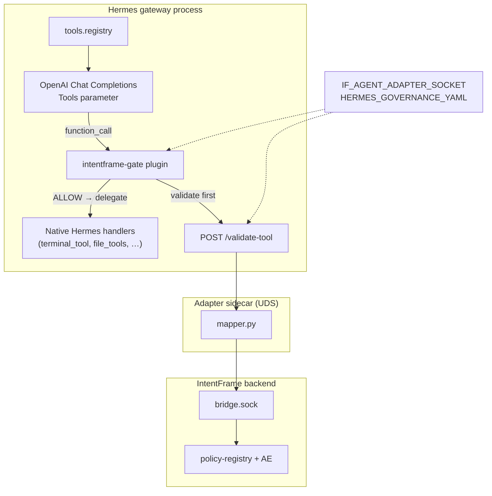

# Hermes + IntentFrame integration guide

> How to wire IntentFrame governance into Hermes, add or change governed tools, and
> avoid the gateway registration-order failures that look like “LLM flakiness” but are
> actually **missing registry entries** at schema-build time.

Related:

- [`hermes-plugin-registration-order.md`](./hermes-plugin-registration-order.md) — load-order bug, preload fix, evidence
- [`agent-tool-gating.md`](./agent-tool-gating.md) — portable gating pattern
- [`NATIVE_KIT_INTEGRATION.md`](./NATIVE_KIT_INTEGRATION.md) — native-kit bundles, policy alignment
- [`integrations/hermes/README.md`](../integrations/hermes/README.md) — CLI quick start
- [`integrations/hermes/plugin/intentframe-gate/README.md`](../integrations/hermes/plugin/intentframe-gate/README.md) — plugin env and architecture

---

## TL;DR

| Layer | What it does | Where |
|-------|--------------|-------|
| **Governance contract** | Which Hermes tool *names* are IntentFrame-governed | `governance/tools.yaml` + `HERMES_GOVERNANCE_YAML` |
| **Plugin (`intentframe-gate`)** | Inject `reason`, wrap handler, call adapter before delegate | `$HERMES_HOME/plugins/intentframe-gate/` |
| **Adapter sidecar** | Map tool args → IntentFrame `/validate` payloads | `integrations/hermes/adapter/` |
| **IntentFrame backend** | Policy evaluation (ALLOW / BLOCK) | bridge + executor + policy-registry |

**Critical pitfall:** Hermes gateway runs `discover_plugins()` **before** builtin tool
modules import. If your plugin wraps tools via `registry._snapshot_entries()` without
preloading governed modules first, the snapshot is empty and governed tools never
reach the OpenAI **Tools** parameter — even when `GET /v1/toolsets` lists them.

**The old `intentframe-terminal` plugin and the new generic gate differ mainly in
*which import statements run at plugin load*** — not in gate logic. See
[§ Imports are registration triggers](#imports-are-registration-triggers-not-just-dependencies).

---

## Architecture



Request path for a **governed** tool call:

1. Model emits `function_call` with `reason` + tool args (schema layer 1).
2. Plugin wrapped handler runs `gate_tool_call()` (layer 2).
3. Adapter maps args to IntentFrame action(s) and calls the bridge.
4. On ALLOW, plugin strips `reason` and delegates to the original Hermes handler.

Evidence — plugin registration and wrap:

```14:35:integrations/hermes/plugin/intentframe-gate/__init__.py
def register(ctx) -> None:
    """Wrap governed tools and hook future registry registrations."""
    from tools.registry import registry

    install_registry_hook()

    governed = governed_tool_names()
    preload_governed_builtins(governed)

    for entry in registry._snapshot_entries():
        if entry.name not in governed:
            continue
        ctx.register_tool(
            name=entry.name,
            toolset=entry.toolset,
            schema=inject_reason(entry.schema, tool_name=entry.name),
            handler=wrap_handler(entry.name, entry.handler, is_async=entry.is_async),
            check_fn=entry.check_fn,
            is_async=entry.is_async,
            emoji=entry.emoji or "",
            override=True,
        )
```

Evidence — validate-then-delegate:

```63:89:integrations/hermes/plugin/intentframe-gate/gate.py
def gate_tool_call(
    tool_name: str,
    args: dict[str, Any],
    *,
    delegate: Callable[..., Any],
    validator: ToolValidator | None = None,
    is_async: bool = False,
    **kw: Any,
) -> Any:
    """Validate via Hermes adapter, then delegate to the original handler."""
    ...
    if not result.get("allowed"):
        detail = result.get("error") or "Tool call blocked by IntentFrame policy"
        return blocked_response(str(detail), spec=spec, result=result)

    clean_args = {k: v for k, v in args.items() if k != "reason"}
    return delegate(clean_args, **kw)
```

---

## Two different “tool surfaces” (do not conflate)

Hermes exposes tool names in **two unrelated ways**. Mixing them up caused days of
false debugging (“`/v1/toolsets` shows terminal, so why doesn’t the model call it?”).

| Surface | API / code path | Answers |
|---------|-----------------|---------|
| **Config / listing** | `GET /v1/toolsets` → `resolve_toolset()` | Which toolsets Hermes *config* enables for api_server |
| **Runtime LLM payload** | `POST /v1/responses` → `get_tool_definitions()` → `registry.get_definitions()` | Which tools have **registry entries** and pass `check_fn` |

Evidence — silent skip when no registry entry:

```356:357:external-reference-only-libs/hermes-agent/tools/registry.py
            if not entry:
                continue
```

Evidence — E2E contract treats them separately:

```1:5:tests/hermes_gateway/toolsets_contract.py
"""Contract for GET /v1/toolsets after intentframe-gate integration.

Validates the Hermes api_server tool *name* surface the LLM can choose from.
Names only — full JSON schemas are probed separately via ``probe_hermes_tool_schemas.py``.
"""
```

**Rule:** when debugging “model never calls tool X”, verify X appears in the **OpenAI
Tools block** (trace or gateway agent-init logs), not only on `/v1/toolsets`.

---

## Integration checklist (production CLI path)

From repo root, with `OPENAI_API_KEY` set:

```bash
uv sync --all-packages

bin/intentframe-integrations install hermes
bin/intentframe-integrations start hermes      # IntentFrame backend + adapter
bin/intentframe-integrations integrate hermes   # plugin symlink + config + governance seed
bin/intentframe-integrations doctor hermes        # contract alignment checks
bin/intentframe-integrations gateway start hermes --api-server
```

What `integrate hermes` does (evidence):

```35:37:intentframe-integrations-cli/src/intentframe_integrations/hermes_integrate.py
PLUGIN_KEY = "intentframe-gate"
PLUGIN_DIR_NAME = "intentframe-gate"
REMOVED_PLUGIN_KEYS = frozenset({"intentframe-terminal"})
```

- Symlinks `integrations/hermes/plugin/intentframe-gate` → `$HERMES_HOME/plugins/intentframe-gate`
- Adds `intentframe-gate` to `plugins.enabled` in `$HERMES_HOME/config.yaml`
- Syncs adapter venv; seeds runtime governance yaml
- Prints `export IF_AGENT_ADAPTER_SOCKET=…` and `export HERMES_GOVERNANCE_YAML=…`

Required env (defaults from `agent.json`):

```15:18:integrations/hermes/agent.json
  "env": {
    "IF_AGENT_ADAPTER_SOCKET": "~/.intentframe/integrations/hermes/adapter.sock",
    "HERMES_GOVERNANCE_YAML": "~/.intentframe/integrations/hermes/governance/tools.yaml"
  }
```

Gateway inherits env via `build_gateway_env()`:

```228:243:intentframe-integrations-cli/src/intentframe_integrations/hermes_gateway.py
def build_gateway_env(
    pack: IntegrationPack,
    *,
    api_server: bool = False,
    ...
) -> dict[str, str]:
    env = os.environ.copy()
    env["HERMES_HOME"] = str(hermes_home())
    for key, value in pack.agent.env.items():
        env.setdefault(key, os.path.expanduser(value))
    ...
    return env
```

**After changing governance yaml:** restart adapter **and** gateway — both load the
contract at process start (`governed_tool_names()` is cached in the plugin).

---

## Governed vs ungoverned vs Hermes-enabled

Three independent knobs:

| Concept | Meaning | Controlled by |
|---------|---------|---------------|
| **Hermes tool enabled** | Name appears on `/v1/toolsets` for api_server | Hermes `$HERMES_HOME/config.yaml` toolsets |
| **IntentFrame governed** | Plugin wrap + adapter validate active | `enabled: true` in governance yaml |
| **Policy allows action** | IntentFrame returns ALLOW | `policy.yaml` + seeded policy-registry |

Governance template (v1 catalog — five tools):

```6:41:integrations/hermes/governance/tools.yaml
tools:
  terminal:
    enabled: true
    action: RUN_COMMAND
    ...
  process:
    enabled: true
    ...
  write_file:
    enabled: true
    ...
  delete_file:
    enabled: true
    ...
  patch:
    enabled: true
    ...
```

Toggle at runtime:

```bash
bin/intentframe-integrations governance list hermes
bin/intentframe-integrations governance disable hermes write_file
bin/intentframe-integrations governance enable hermes write_file
```

Reads (`read_file`, `search_files`, `browser_snapshot`, …) stay **ungoverned** in v1
unless explicitly added to the contract — govern by **tool name**, not toolset.

---

## Plugin: three registration mechanisms

| # | Mechanism | File | When |
|---|-----------|------|------|
| 1 | **Selective preload** | `builtin_preload.py` | Before snapshot — imports governed Hermes modules |
| 2 | **Snapshot wrap** | `__init__.py` | After preload — `override=True` gated schema + handler |
| 3 | **Registry hook** | `registry_hook.py` | Every `registry.register` — MCP refresh, late tools |

### 1. Selective preload

```12:29:integrations/hermes/plugin/intentframe-gate/builtin_preload.py
GOVERNED_BUILTIN_MODULES: dict[str, str] = {
    "terminal": "tools.terminal_tool",
    "process": "tools.process_registry",
    "write_file": "tools.file_tools",
    "patch": "tools.file_tools",
}

def preload_governed_builtins(governed: frozenset[str]) -> None:
    ...
            importlib.import_module(module_name)
```

**Why not call `discover_builtin_tools()` in the plugin?**

Hermes discovers builtins by AST-scanning `tools/*.py` and importing every module
with a top-level `registry.register()`:

```57:70:external-reference-only-libs/hermes-agent/tools/registry.py
def discover_builtin_tools(tools_dir: Optional[Path] = None) -> List[str]:
    """Import built-in self-registering tool modules and return their module names."""
    ...
            importlib.import_module(mod_name)
```

That imports **all** self-registering tools — including `read_terminal_tool.py`,
which registers `read_terminal` into the terminal toolset. The E2E contract expects
exactly `['process', 'terminal']`:

```55:57:tests/hermes_gateway/toolsets_contract.py
TOOLSET_TOOL_EXPECTATIONS: dict[str, frozenset[str]] = {
    "terminal": frozenset({"terminal", "process"}),
```

Selective preload avoids that side effect while still populating the registry before
snapshot.

### 2. Schema layer — `inject_reason()`

```22:55:integrations/hermes/plugin/intentframe-gate/schema.py
def inject_reason(schema: dict[str, Any], *, tool_name: str) -> dict[str, Any]:
    """Return a deep copy of *schema* with required ``reason`` (idempotent)."""
    ...
    if "reason" not in required:
        required.append("reason")
```

Terminal gets slightly different reason copy; all governed tools require `reason` in
the JSON schema the model sees.

### 3. Registry hook (MCP / late registration)

```40:43:integrations/hermes/plugin/intentframe-gate/registry_hook.py
        if name in governed and not getattr(handler, GATED_MARKER, False):
            schema = inject_reason(schema, tool_name=name)
            handler = wrap_handler(name, handler, is_async=is_async)
```

The hook **complements** preload + snapshot; it must not be the **only** path for
Hermes builtins on gateway startup.

---

## Imports are registration triggers (not just dependencies)

This is the core lesson from the June 2026 E2E regression.

### What Hermes builtins do at import time

`tools/terminal_tool.py` registers at module bottom:

```2711:2719:external-reference-only-libs/hermes-agent/tools/terminal_tool.py
registry.register(
    name="terminal",
    toolset="terminal",
    schema=TERMINAL_SCHEMA,
    handler=_handle_terminal,
    check_fn=check_terminal_requirements,
    emoji="💻",
    max_result_size_chars=100_000,
)
```

Importing the module **is** registration. There is no separate “register terminal” API
call you can skip.

### Old plugin (`intentframe-terminal`) — one import, one wrap

Conceptually:

```python
build_terminal_schema()   # side effect: import tools.terminal_tool → registry.register("terminal")
ctx.register_tool("terminal", gated_schema, gated_handler, override=True)
```

The diff from broken → fixed generic gate was **not** “add more gate logic”. It was
**restore the early import** in a generic form:

| Version | Import behavior at `register()` | Snapshot result |
|---------|--------------------------------|-----------------|
| `intentframe-terminal` | `import tools.terminal_tool` (via schema builder) | `terminal` present → wrapped |
| Broken `intentframe-gate` | none | `wrapped = []` |
| Fixed `intentframe-gate` | `preload_governed_builtins(governed)` | governed names present → wrapped |

### Gateway load order (why timing matters)

Gateway explicitly discovers plugins **before** lazy `model_tools` import:

```5343:5351:external-reference-only-libs/hermes-agent/gateway/run.py
        # Discover Python plugins before shell hooks ...
        # gateway lazily imports run_agent inside per-request handlers,
        # so the discover_plugins() side-effect in model_tools.py is NOT
        # guaranteed to have run by the time we reach this point.
        try:
            from hermes_cli.plugins import discover_plugins
            discover_plugins()
```

Builtin discovery runs at `model_tools` import (typically first `/v1/responses`):

```176:180:external-reference-only-libs/hermes-agent/model_tools.py
# Tool Discovery  (importing each module triggers its registry.register calls)
# =============================================================================

discover_builtin_tools()
```

So at plugin `register()` time the registry is empty unless **your plugin** imports
the modules first.

### Scrutinize import changes like API changes

When editing `GOVERNED_BUILTIN_MODULES` or any plugin import:

| Change | Risk |
|--------|------|
| Remove a module mapping | Tool missing from OpenAI Tools → model cannot call it |
| Wrong module path | Import warning; snapshot skip for that tool |
| Add `discover_builtin_tools()` | Extra tools (`read_terminal`) break toolsets contract |
| Import a module that registers multiple tools | May govern/wrap more than intended |

**Review checklist for import PRs:**

1. Is the tool in the governance catalog with `enabled: true`?
2. Does Hermes register it at **module import** time? → needs preload entry.
3. Does it register only via MCP / dynamic path? → hook may suffice; no preload.
4. Run unit + contract tests (below).

---

## Adding a new governed Hermes tool

Work through **all** layers. Wrapping alone is insufficient without mapper + policy.

### Step 1 — Governance contract

Add entry to `integrations/hermes/governance/tools.yaml`:

```yaml
  my_tool:
    enabled: true
    action: WRITE_HOST_FILE   # or RUN_COMMAND, DELETE_HOST_FILE, …
    risk: local_write
    mapper: my_tool           # must exist in mapper.py
    blocked_response: generic_json
```

Runtime copy: `~/.intentframe/integrations/hermes/governance/tools.yaml`.

Valid mapper kinds (plugin loader):

```14:14:integrations/hermes/plugin/intentframe-gate/governance_loader.py
VALID_MAPPER_KINDS = frozenset({"terminal", "process", "write_file", "delete_file", "patch"})
```

Extend this set when adding a new mapper kind.

### Step 2 — Adapter mapper

Add `map_my_tool()` in `integrations/hermes/adapter/src/hermes_adapter/mapper.py`
and register in `MAPPERS`. Must produce IntentFrame validate payloads including
`reason` (adapter validates reason locally too):

```34:44:integrations/hermes/adapter/src/hermes_adapter/mapper.py
def validate_reason(reason: object) -> str:
    if reason is None:
        raise ValidationError("Missing required field: reason")
    ...
```

Multi-intent tools (like `patch`) return a **list** of intents; adapter fails closed
on first BLOCK.

### Step 3 — Policy

Add rules to `integrations/hermes/policy.yaml` for the action type(s). Ensure
`agent.json` lists the action type:

```5:5:integrations/hermes/agent.json
  "action_types": ["RUN_COMMAND", "WRITE_HOST_FILE", "DELETE_HOST_FILE"],
```

### Step 4 — Plugin preload (if Hermes builtin)

If the tool is a Hermes built-in registered at import time, add to
`GOVERNED_BUILTIN_MODULES`:

```python
"my_tool": "tools.my_tool_module",
```

If several catalog names share one module (like `write_file` + `patch` → `file_tools`),
one import is enough — preload dedupes modules.

`delete_file` is in the governance catalog but has **no** Hermes 0.17 standalone
registry module — E2E marks it as not on api_server surface:

```24:26:tests/hermes_gateway/toolsets_contract.py
# Governed tools in governance/tools.yaml that are not standalone Hermes 0.17 registry tools.
GOVERNED_TOOLS_NOT_ON_API_SERVER = frozenset({"delete_file"})
```

### Step 5 — E2E probes

Add probe functions to `tests/hermes_gateway/test_gateway_e2e.py` and register symbols
in `tests/hermes_governance_fixtures.py` (`GATEWAY_E2E_PROBE_SYMBOLS`). Coverage test
enforces parity:

```25:29:tests/hermes_gateway/test_governed_tool_coverage.py
    def test_gateway_probe_registry_covers_catalog(self) -> None:
        self.assertEqual(
            frozenset(GATEWAY_E2E_PROBE_SYMBOLS),
            template_catalog_tool_names(),
        )
```

### Step 6 — Verify

See [Testing pyramid](#testing-pyramid) below.

---

## Modifying an existing governed tool

### Schema changes (prompt / parameters)

Prefer **`inject_reason()`** and Hermes native schema — do not fork entire schemas in
the plugin unless necessary. Terminal-specific reason text lives here:

```36:47:integrations/hermes/plugin/intentframe-gate/schema.py
    if tool_name == "terminal":
        props["reason"] = {
            "type": "string",
            "description": (
                "Why you are running this command and what outcome you expect. "
                ...
            ),
        }
```

After schema changes, restart gateway (registry `_generation` memoization in Hermes).

### Handler / validation behavior

- **Policy-only change** → edit `policy.yaml`, re-seed or update policy-registry.
- **Mapping change** → edit adapter `mapper.py` (what IntentFrame sees).
- **Block response shape** → `blocked_response` in governance yaml +
  `gate.py` `blocked_response()` (`terminal_json` vs `generic_json`).

### Enabling/disabling governance for a tool

Set `enabled: false` in runtime governance yaml — tool stays in catalog but runs
**native Hermes** without plugin gate. Plugin reads governed set from:

```47:50:integrations/hermes/plugin/intentframe-gate/governance_loader.py
def _resolve_yaml_path() -> Path:
    env_path = os.environ.get("HERMES_GOVERNANCE_YAML", "").strip()
    if env_path:
        path = Path(env_path).expanduser()
```

Preload only imports modules for names in the **runtime governed set** — disabling a
tool in yaml stops preloading/wrapping it on next gateway restart.

---

## Testing pyramid

Run cheap tests first; full E2E last.

### Layer 1 — Unit (no network, no Hermes install)

```bash
# Preload import map
uv run python tests/hermes_plugin/test_builtin_preload.py

# Schema + gate + governance loader parity
uv run python tests/hermes_plugin/test_gate.py

# Scoped governance yaml + env contract
uv run --package intentframe-integrations-cli python tests/intentframe_integrations/test_scoped_governance_yaml.py

# Probe symbol coverage for all 5 catalog tools
uv run --package intentframe-integrations-cli python tests/hermes_gateway/test_governed_tool_coverage.py
```

Extend `test_builtin_preload.py` when adding `GOVERNED_BUILTIN_MODULES` entries.

### Layer 2 — Toolsets contract (Hermes install, no LLM)

```bash
RUN_HERMES_GATEWAY_TOOLSETS=1 ./tests/scripts/test-hermes-gateway-toolsets.sh
```

Asserts `terminal: ['process', 'terminal']` and governed tool schema markers.

### Layer 3 — Scoped gateway E2E (fast smoke)

```bash
HERMES_E2E_GOVERNED_TOOLS=terminal RUN_HERMES_GATEWAY_E2E=1 \
  ./tests/scripts/test-hermes-gateway-e2e.sh
```

Expect: `POST /v1/responses ALLOW (attempt 1/3)`, passes 1/2a/2b.

### Layer 4 — Full gateway E2E (all 5 governed tools)

```bash
# Default — all catalog tools governed
RUN_HERMES_GATEWAY_E2E=1 ./tests/scripts/test-hermes-gateway-e2e.sh
```

Runs ALLOW/BLOCK/semantic probes for `terminal`, `process`, `write_file`, `delete_file`,
`patch` across greenfield, idempotent, and external-`HERMES_BIN` paths.

Probe matrix: [`tests/hermes_gateway/README.md`](../tests/hermes_gateway/README.md).

---

## Troubleshooting

| Symptom | Likely cause | What to check |
|---------|--------------|---------------|
| ALLOW E2E: no `function_call` / wrong tool | Tool not in OpenAI **Tools** list | OpenAI trace; `wrapped` empty at plugin load → preload map |
| `/v1/toolsets` has tool, model doesn’t call it | Config surface ≠ registry surface | [`hermes-plugin-registration-order.md`](./hermes-plugin-registration-order.md) |
| Model calls tool, IntentFrame logs empty | Ungoverned at runtime | `HERMES_GOVERNANCE_YAML` path; gateway stderr `Hermes governance config:` |
| Validate always BLOCK | Mapper/policy mismatch | adapter log; `doctor hermes` contract lines |
| `read_terminal` in terminal toolset | Full builtin discovery in plugin | Use selective preload only |
| Gateway health timeout | Crash on boot | sandbox `gateway.log` |
| Stale governance after edit | Process not restarted | restart adapter + gateway |

**Debug order:**

1. Confirm env: `HERMES_GOVERNANCE_YAML`, `IF_AGENT_ADAPTER_SOCKET` in gateway process.
2. Confirm plugin enabled in `$HERMES_HOME/config.yaml`.
3. OpenAI trace — is the tool in **Tools**?
4. Tail sandbox `gateway.log` + `intentframe-server.log`.

---

## References (source index)

| Topic | Location |
|-------|----------|
| Plugin register | [`integrations/hermes/plugin/intentframe-gate/__init__.py`](../integrations/hermes/plugin/intentframe-gate/__init__.py) |
| Preload map | [`integrations/hermes/plugin/intentframe-gate/builtin_preload.py`](../integrations/hermes/plugin/intentframe-gate/builtin_preload.py) |
| Gate + wrap | [`integrations/hermes/plugin/intentframe-gate/gate.py`](../integrations/hermes/plugin/intentframe-gate/gate.py) |
| Registry hook | [`integrations/hermes/plugin/intentframe-gate/registry_hook.py`](../integrations/hermes/plugin/intentframe-gate/registry_hook.py) |
| Adapter mapper | [`integrations/hermes/adapter/src/hermes_adapter/mapper.py`](../integrations/hermes/adapter/src/hermes_adapter/mapper.py) |
| CLI integrate | [`intentframe-integrations-cli/.../hermes_integrate.py`](../intentframe-integrations-cli/src/intentframe_integrations/hermes_integrate.py) |
| Gateway env | [`intentframe-integrations-cli/.../hermes_gateway.py`](../intentframe-integrations-cli/src/intentframe_integrations/hermes_gateway.py) |
| Hermes registry | [`external-reference-only-libs/hermes-agent/tools/registry.py`](../external-reference-only-libs/hermes-agent/tools/registry.py) |
| Hermes gateway startup | [`external-reference-only-libs/hermes-agent/gateway/run.py`](../external-reference-only-libs/hermes-agent/gateway/run.py) |
| E2E harness | [`tests/hermes_gateway/`](../tests/hermes_gateway/) |
| Load-order deep dive | [`hermes-plugin-registration-order.md`](./hermes-plugin-registration-order.md) |
