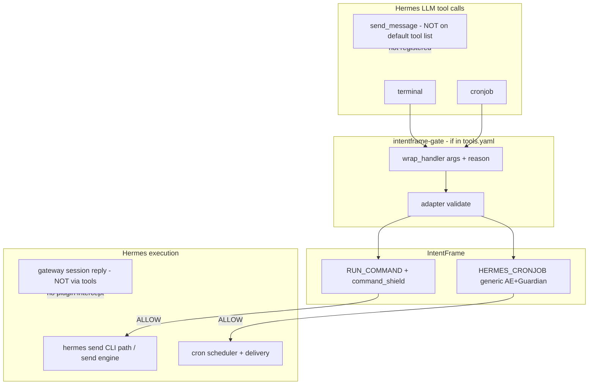

# Hermes outbound messaging, cronjob governance, and IntentFrame validation

> Comprehensive reference (June 2026): how Hermes sends messages to third parties,
> what the LLM can call, what IntentFrame sees at validate time, and what to govern
> now vs defer.
>
> Related:
> [`hermes-intentframe-integration-guide.md`](./hermes-intentframe-integration-guide.md),
> [`hermes-governance-execute-code-and-schema-hooks.md`](./hermes-governance-execute-code-and-schema-hooks.md),
> [`NATIVE_KIT_INTEGRATION.md`](./NATIVE_KIT_INTEGRATION.md),
> [`agent-tool-gating.md`](./agent-tool-gating.md),
> [`integrations/hermes/governance/tools.yaml`](../integrations/hermes/governance/tools.yaml).

---

## TL;DR

| Question | Answer |
|----------|--------|
| Can Hermes send Slack / email / WhatsApp / SMS to **someone else**? | **Yes** — via the shared send engine (`tools/send_message_tool.py`), CLI `hermes send`, cron delivery, gateway adapters. |
| Does the **default LLM** get a `send_message` tool? | **No** — Hermes deliberately does **not** register `send_message` as an agent-callable tool. |
| How does the LLM usually do proactive outbound? | **Official:** **`cronjob`** + `deliver=…` (scheduled/cross-channel). **Not official:** `terminal` → `hermes send` (possible workaround; Hermes docs position `hermes send` as **no LLM**). |
| Can IntentFrame intercept that? | **Yes** if `terminal` / `cronjob` are in `governance/tools.yaml` with `enabled: true`. |
| Do AE/Guardian need a Hermes CLI manual to *recognize* email send? | **No** — full command is in `RUN_COMMAND.command`; cron `deliver` is structured in `hermes_args`. |
| v1 recommendation | **Keep `cronjob` enabled**; govern **`terminal`**; **defer** native `send_message` / dedicated send mappers until stricter policy is needed. |
| Session reply (same chat) | **Not a tool call** — gateway delivery; plugin does not see send args. |

---

## 1. Terminology

### Governed vs Hermes-enabled

| | Governed (`enabled: true` in yaml) | Ungoverned |
|---|-----------------------------------|------------|
| Plugin wraps handler | yes | no |
| Model sees required `reason` | yes (if tool is on LLM list) | no |
| Adapter `/validate` before side effect | yes | no |
| Tool may still appear on `/v1/toolsets` | often | yes |

See [`agent-tool-gating.md`](./agent-tool-gating.md#terminology-what-governed-means).

### Proactive outbound vs reply-in-session

| Kind | Example | Mechanism | IntentFrame tool args? |
|------|---------|-----------|------------------------|
| **Reply in current chat** | User DMs Telegram bot → agent answers | Gateway session **delivery** | **No** — not a registry tool call |
| **Proactive outbound** | “Email Bob”, “Slack the team”, “WhatsApp my friend” | **Official:** **`cronjob`** + `deliver`. **Workaround:** **`terminal`** + `hermes send` (not Hermes-documented agent API) | **Yes** (when those tools are governed) |

This document focuses on **proactive outbound** and **IntentFrame validate-time visibility**.

### Two different LLMs

| LLM | Role |
|-----|------|
| **Hermes agent** | Chooses tools (`terminal`, `cronjob`, …) and fills args |
| **IntentFrame AE + Guardian** | Judge validate payloads at `/validate` (ALLOW / BLOCK / NEEDS_REVIEW) |

Both can “understand” `hermes send --to email:…` — the agent chose it; AE/Guardian read `intent.command`.

---

## 2. Hermes outbound messaging architecture

### Send engine (not an LLM tool by default)

Cross-platform sending lives in **`external-reference-only-libs/hermes-agent/tools/send_message_tool.py`**.

Supported platforms (via `gateway/config.py` `Platform` enum and send routing) include
**Telegram, Discord, Slack, WhatsApp, WhatsApp Cloud, Signal, SMS, Email, Feishu,
Matrix, DingTalk, WeCom, Weixin, Yuanbao**, and others.

Target format (when using the send engine):

```
platform                          → home channel for platform
platform:chat_id                  → explicit recipient/channel
platform:chat_id:thread_id        → Telegram topics, Discord threads
email:user@domain.com             → email address
slack:#engineering                → channel name
sms:+15551234567                  → E.164 phone
```

Hermes **intentionally does not** register `send_message` for the model:

```text
# tools/send_message_tool.py (registry section)
# NOTE: ``send_message`` is intentionally NOT registered as an agent-callable
# model tool. The agent should not decide on its own to fire off cross-platform
# messages or reactions.
```

The send engine is still used by:

| Caller | Purpose |
|--------|---------|
| **`hermes send` CLI** | Scripts, ops, CI — `hermes_cli/send_cmd.py` |
| **Cron scheduler delivery** | Job output → `deliver=telegram:…`, `email:…`, etc. |
| **Gateway kanban notifier** | Dashboard-driven, outside agent loop |
| **MCP server** | Opt-in `messages_send` in `mcp_serve.py` |

### Toolsets exclude `send_message`

`hermes-api-server` and `_HERMES_CORE_TOOLS` (Telegram/Slack/WhatsApp bot toolsets)
do **not** include `send_message`. Toolsets comment:

```text
# agents do NOT get an agent-callable send_message tool — outbound platform
# messaging is handled outside the agent loop (cron delivery, kanban notifier,
# `hermes send` CLI), not by the model deciding to send on its own.
```

**Exception:** `hermes-discord` adds **`discord`** / **`discord_admin`** (Discord REST
API, not the generic send engine). **Yuanbao** adds **`yb_send_dm`** when that gateway
is active.

---

## 3. Verified: how Hermes community / official docs use outbound messaging

Cross-checked against **Nous Research Hermes upstream** (`external-reference-only-libs/hermes-agent`)
and public docs ([CLI `hermes send`](https://hermes-agent.nousresearch.com/docs/reference/cli-commands),
[Pipe script output](https://hermes-agent.nousresearch.com/docs/guides/pipe-script-output),
[Automate with cron](https://hermes-agent.nousresearch.com/docs/guides/automate-with-cron),
[Scheduled tasks (cron)](https://hermes-agent.nousresearch.com/docs/user-guide/features/cron)).

### Three official outbound surfaces (not interchangeable)

| Surface | Who invokes | LLM involved? | Primary use |
|---------|-------------|---------------|-------------|
| **Gateway session reply** | Gateway after agent turn | Agent generates text; **delivery is not a tool call** | User chats on Telegram/Discord/Slack/WhatsApp/Email; agent replies **in that chat** |
| **`cronjob` + `deliver`** | Agent (`cronjob` tool) or user (`hermes cron`, `/cron`) | Yes for LLM jobs; optional `no_agent` + script | **Scheduled** reports/alerts to `telegram`, `slack`, `email`, `sms`, `whatsapp`, … |
| **`hermes send` CLI** | Human scripts, CI, monitoring | **Explicitly no** — “no agent loop, no LLM” per official CLI docs | One-shot notifications from shell (`hermes send --to telegram "…"`) |

Official cron docs state you **do not need `send_message` in the cron prompt** — the
scheduler auto-delivers the agent’s **final response** (or script stdout for
`no_agent=True`) to the `deliver` target.

Official automate guide distinguishes:

- **Recurring / scheduled cross-channel** → cron with `--deliver`
- **One-shot from an already-running script** → `hermes send` (not the agent tool loop)

### What is **not** an official Hermes agent tool

- **`send_message`** — schema exists in `send_message_tool.py` but is **not** `registry.register`’d
  for the model (`toolsets.py` comment + registry section).
- **`delegate_task`** blocks `send_message` for subagents (`DELEGATE_BLOCKED_TOOLS`).
- Some **skills** still mention `send_message` (e.g. research-paper-writing) — **stale relative
  to the default tool list**; Yuanbao skill correctly points to **`yb_send_dm`** instead.

### IntentFrame-relevant LLM paths for “message someone else”

When the user is **not** in the destination chat (e.g. CLI user says “Slack the team” or
“email Bob”):

| User ask | Hermes-official path | IF tool-call args (if governed) |
|----------|---------------------|----------------------------------|
| “Send every morning at 9 / weekly digest to Telegram” | **`cronjob`** `action=create`, **`deliver=telegram:…`**, `prompt=…` | **`deliver`**, **`prompt`**, `schedule` — **documented & common** |
| “Monitor RAM and ping Telegram when high” | **`cronjob`** + `no_agent=True` + `script=` + `deliver=telegram` | same (+ `script`, `no_agent`) |
| “Slack/email/WhatsApp **right now** to a third party” | **No first-class LLM tool** | Agent may **work around** via **`terminal`** running `hermes send …` — **not documented in Hermes prompts** (only `toolsets.py` comment); behavior is **model-dependent** |
| Agent-owned email (optional MCP) | MCP AgentMail **`send_message`** | `to`, `subject`, `text` (MCP must be configured) |
| Yuanbao DM | **`yb_send_dm`** (Yuanbao gateway) | `name`, `message`, `group_code`, … |
| Discord server ops | **`discord`** / **`discord_admin`** (`hermes-discord` toolset) | Discord-specific actions |

**For IntentFrame governance:** **`cronjob`** is the **verified** agent tool path for
cross-platform outbound delivery. **`terminal`** matters because agents **may** shell out
to `hermes send` for immediate sends — worth governing, but that pattern is a **workaround**,
not Hermes’s documented agent API.

**Most structured destination field:** **`cronjob.deliver`** (matches official cron docs).

---

## 4. IntentFrame: what gets validated

### Plugin gate (governed tools only)

```
LLM tool call (args + reason)
  → intentframe-gate wrap_handler / gate_tool_call
  → POST adapter /validate-tool
  → map_tool() → IntentFrame intent(s)
  → bridge /validate → bundles + AE + Guardian
  → ALLOW → strip reason → Hermes native handler
  → BLOCK → JSON error, no side effect
```

Only tools in **`governance/tools.yaml`** with **`enabled: true`** are wrapped.
Adding a yaml entry for a tool **not in the Hermes registry** does nothing.

### Mapper summary (current catalog)

| Hermes tool | IF action | Mapper | What validate sees |
|-------------|-----------|--------|-------------------|
| `terminal` | `RUN_COMMAND` | `terminal` | `command`, `reason`, `target` (= command prefix) |
| `execute_code` | `RUN_COMMAND` | `execute_code` | `command` = `python -c …` (for `command_shield`) |
| `write_file` | `WRITE_HOST_FILE` | `write_file` | path, content, reason |
| `patch` | `WRITE_HOST_FILE`, `DELETE_HOST_FILE` | `patch` | multi-intent V4A ops |
| `cronjob` | `HERMES_CRONJOB` | `generic` | `reason`, full args in `hermes_args` (incl. `deliver`, `prompt`) |

**Generic mapper** (`map_generic`): passes all tool args (except mapped keys) in
`hermes_args` — no Hermes-specific normalization.

### Paths IntentFrame does **not** gate

| Path | Why |
|------|-----|
| `hermes send` CLI (no LLM) | Bypasses registry |
| MCP `messages_send` (unless tool name governed) | Direct import of send engine |
| Gateway **session reply** | Delivery layer, not tool handler |
| Cron scheduler **delivery** after job runs | Send engine; only **creating** the job is a tool call if via `cronjob` |

---

## 5. Cronjob governance

### Catalog entry

```yaml
cronjob:
  enabled: true
  action: HERMES_CRONJOB
  risk: local_process
  mapper: generic
  blocked_response: generic_json
  builtin_module: tools.cronjob_tools
```

### Should `enabled` be true?

| | Recommendation |
|---|----------------|
| **Enable (`true`)** | Default for production — persistence + scheduled outbound delivery are high risk; gate validates before create/update/run. |
| **Disable (`false`)** | Tool may still run **ungoverned** if on LLM list; only use if you removed cron from the surface entirely. |

Governance and policy are **independent**: disabling stops intents; `HERMES_CRONJOB`
policy row can remain.

### What validation does for `cronjob`

1. **`GenericDynamicBundle`** — semantic-only (AE + Guardian); no `command_shield`, no path allowlists.
2. **Policy** — `HERMES_CRONJOB: safe: false` only (no constraints unlike `RUN_COMMAND`).
3. **Hermes `check_fn`** — tool may be hidden from schemas unless `HERMES_GATEWAY_SESSION=1` (gateway session env).

### Security review focus (cronjob)

| Risk | Notes |
|------|-------|
| **Persistence** | Create/enable recurring jobs |
| **Weaker than `terminal`** | Scheduled command body not analyzed by `command_shield` via `RUN_COMMAND` |
| **Outbound via `deliver`** | `deliver=email:…`, `slack:…`, `sms:…`, `all` — visible in `hermes_args` when governed |
| **Semantic-only BLOCK/ALLOW** | Live probes use low-risk `action: list`; create/enable outcomes are not deterministic E2E |

### `deliver` field (outbound visibility)

From `cronjob` schema — explicit destinations for scheduled delivery:

```text
deliver examples:
  origin          → current conversation (default behavior)
  local           → no delivery
  all             → fan out to connected home channels
  telegram:-100…:17585
  discord:#engineering
  sms:+15551234567
  email:…         (via platform-specific deliver string)
```

When governed, **`deliver`** and **`prompt`** appear in validate payload `hermes_args`.

---

## 6. IntentFrame “messaging actions” (native-kit)

Distinct from Hermes tool names — these are **IntentFrame action IDs**:

| Action ID | Bundle | Policy knobs |
|-----------|--------|--------------|
| **`SEND_MESSAGE`** | `MessageActionBundle` | `allowed_contacts`, `contact_sources` |
| **`READ_MESSAGES`** | same (passive read) | contact constraints on `contact` |
| **`SHOW_MESSAGE`** | `UserIoActionBundle` | UI prompt — **not** outbound send |
| **`HTTP_POST` / `HTTP_GET`** | `ApiActionBundle` | `allowed_endpoints` |
| **`SEND_EMAIL`, …** | `EmailActionBundle` | email-specific constraints |

**Hermes integration v1** ships only:

`RUN_COMMAND`, `WRITE_HOST_FILE`, `DELETE_HOST_FILE`, `HERMES_CRONJOB`

No `SEND_MESSAGE` or `HTTP_POST` in `agent.json` / `tools.yaml` today.

Planned Hermes → IF mappings (Tier B in [`NATIVE_KIT_INTEGRATION.md`](./NATIVE_KIT_INTEGRATION.md)):

| Hermes | Suggested IF action |
|--------|---------------------|
| `send_message` (if exposed) | `SEND_MESSAGE` or `HERMES_*` generic |
| `discord`, `feishu_*` | `HTTP_POST` / `SEND_MESSAGE` |
| MCP AgentMail `send_message` | `SEND_MESSAGE` (if governed by tool name) |

---

## 7. Gating send: yaml-only is not enough for `send_message`

Your plugin pattern works for **registered** LLM tools:

1. Name in `governance/tools.yaml` + `enabled: true`
2. `builtin_module` preload (if Hermes builtin)
3. Snapshot + `registry.register` hook wraps handler
4. Adapter mapper + policy artifacts

**Adding yaml alone for `send_message` fails today** — Hermes does not register it.

To gate **LLM-initiated** proactive send in the future:

1. **Hermes change:** register `send_message` + add to toolset (opt-in).
2. **Repo:** yaml entry, `HERMES_SEND_MESSAGE` (or `SEND_MESSAGE` mapper), manifest, policy, probes.
3. **Or:** parse `hermes send` in `map_terminal` and enrich intent `data`.

Paths that **never** hit the plugin without extra hooks: CLI, MCP direct import,
gateway session delivery.

---

## 8. Observability: intercepting LLM tool args

If the goal is **inspect** recipient, body, platform (not only BLOCK/ALLOW):

| Source | Governed tool | Fields to log |
|--------|---------------|---------------|
| Immediate send | `terminal` | Parse `command` for `hermes send --to …` |
| Scheduled send | `cronjob` | `deliver`, `prompt`, `schedule`, `action` |
| Python sandbox send | `execute_code` | Generated `python -c …` in mapped `command` |
| MCP email | MCP tool name (if wrapped) | `to`, `subject`, `text` |

Intercept point: `gate_tool_call()` receives full **`args`** before adapter validate.

Example `terminal` args:

```json
{
  "command": "hermes send --to email:bob@example.com 'Quarterly update'",
  "reason": "User asked to email Bob"
}
```

Example `cronjob` args:

```json
{
  "action": "create",
  "schedule": "0 9 * * *",
  "prompt": "Tell the team the report is ready",
  "deliver": "slack:#engineering",
  "reason": "User requested daily Slack notification"
}
```

---

## 9. AE and Guardian: do they understand `hermes send`?

### Yes, for recognition (no extra Hermes doc required)

Validate payload for `terminal`:

```json
{
  "action": "RUN_COMMAND",
  "command": "hermes send --to email:alice@company.com 'Hello'",
  "reason": "...",
  "target": "hermes send --to email:..."
}
```

AE and Guardian read **`command`** and **`reason`** as text. They can infer platform,
recipient, and message from the shell string.

For **`cronjob`**, **`deliver`** and **`prompt`** in **`hermes_args`** are clearer than
parsing shell.

### Limits (why defer structured mapping is OK for v1)

| Layer | `hermes send` awareness |
|-------|-------------------------|
| **`command_shield`** | Generic shell analysis — **no** Hermes-specific “outbound message” tag |
| **`blocked_patterns`** | Substring on `command` — blunt (e.g. block all `hermes send`) |
| **AE + Guardian** | Semantic — can **vary** run-to-run without `intent_limits` |
| **Structured policy** | Needs mapper or dedicated action for allowlisted emails/channels |

### Optional policy tightening (later)

**`intent_limits`** in `policy.yaml` — natural-language rules Guardian evaluates:

```yaml
intent_limits:
  - limit_id: outbound-comms
    domain: communication
    description: Proactive outbound messaging via Hermes
    raw: |
      Treat `hermes send` and cronjob `deliver=` to third-party platforms
      (email, slack, whatsapp, sms, telegram) as outbound communication.
      Block unless the user's request clearly authorizes that recipient/channel.
    effect: block
```

**Better than prose alone:** adapter parser for `hermes send` → `data.platform`,
`data.recipient`, `data.message`, or govern native `send_message`.

---

## 10. v1 decision: defer dedicated send governance

**Accepted for current integration:**

| In scope now | Deferred |
|--------------|----------|
| Govern **`terminal`** (catches `hermes send …` in `command`) | Register Hermes `send_message` for LLM |
| Govern **`cronjob`** (structured `deliver`) | Dedicated `HERMES_SEND_MESSAGE` action + mapper |
| Semantic ALLOW/BLOCK via existing paths | Deterministic allowlists for email/Slack/WhatsApp |
| Log/inspect args in plugin or adapter | Gate CLI / MCP / gateway reply delivery |
| Optional `intent_limits` when policy hardens | MCP AgentMail unless MCP tools added to yaml |

**Rationale:** Official Hermes cross-channel outbound from the agent is **`cronjob`**
+ **`deliver`** (documented in cron guides). Agents **may** also shell out via
**`terminal`** → `hermes send` for immediate third-party sends — govern **`terminal`**
for that workaround. Native **`send_message`** is intentionally absent from the LLM
tool list; **`hermes send` CLI** is for scripts/CI without an agent loop.

---

## 11. FAQ

### Can Hermes email / WhatsApp / Telegram / Slack / SMS my friend or business contacts?

**Yes**, if platforms are configured (`hermes gateway setup`, tokens, home channels).

| Who sends | How |
|-----------|-----|
| **You (script/ops)** | **`hermes send`** CLI — official, no LLM |
| **Agent (scheduled / digest / alert)** | **`cronjob`** + **`deliver=…`** — official agent tool path |
| **Agent (reply in chat you're already in)** | Gateway session delivery — not a tool call |
| **Agent (“send Bob an email right now” from CLI)** | **No official tool**; may use **`terminal`** + `hermes send` as an undocumented workaround |

### Do `terminal` and `cronjob` “send messages”?

| Tool | Sends messages? | How |
|------|-----------------|-----|
| **`cronjob`** | **Yes (official)** | Creates jobs; scheduler delivers output to `deliver` (`telegram`, `slack`, `email`, `sms`, …) via send engine |
| **`terminal`** | **Indirectly (workaround)** | Does not send by itself; agent may run **`hermes send …`** as a shell command |
| **`hermes send` CLI** | **Yes** | Direct send — **not** invoked via `terminal` tool unless the agent chooses that command |

### Does the LLM have a “send message” tool?

**Not on default toolsets** (`hermes-api-server`, `hermes-telegram`, etc.). Optional:
MCP `messages_send`, Discord tools, Yuanbao `yb_send_dm`, AgentMail MCP.

### If I add `send_message` to `tools.yaml`, does IntentFrame gate it?

**Not until Hermes registers the tool** and the LLM receives it in `tools=`. Yaml
only wraps names present in the registry snapshot.

### Can I inspect email address and message body from LLM tool calls?

**Yes**, when governed:

- **`terminal`:** parse `command` (contains `--to email:…` and message text).
- **`cronjob`:** read `deliver` and `prompt` directly.

**No** for gateway replies in the chat you’re already in (not a tool call).

### Should cronjob validation be enabled or disabled?

**Enable** for production. Disabling removes IntentFrame gate while the tool may still
run. Cron create/enable is persistence + outbound scheduling risk.

### Is cronjob validation as strong as `terminal`?

**No.** `HERMES_CRONJOB` is semantic-only (generic dynamic bundle). `terminal` uses
`RUN_COMMAND` + `command_shield` + capability tags. Both are still worth governing.

### Do I need to document Hermes CLI for AE/Guardian?

**Not for basic recognition** — they see the full `command` string.

**Yes (or a mapper) for strict, consistent outbound policy** — e.g. allowlist emails,
block personal WhatsApp.

### What about AgentMail (`optional-skills/email/agentmail`)?

Separate **MCP** tools (`send_message` with `to`, `subject`, `text`). Govern only if
that MCP tool name is in yaml and registered. Not covered by `terminal`/`cronjob` alone.

### Does governing `terminal` block all sends?

Only if validate **BLOCK**s. ALLOW passes through to Hermes, which runs `hermes send`.
Governance is validate-before-execute, not removal of capability.

### What tests cover cronjob?

- Unit: `test_map_generic_cronjob` in adapter tests
- Live semantic: `test_cronjob_semantic` (adapter + plugin gate)
- Schema probe: requires `HERMES_GATEWAY_SESSION=1` for cronjob `check_fn`
- No gateway LLM E2E for generic cron mutations (by design)

---

## 12. Future work checklist

When stricter outbound policy is required:

1. [ ] Add **`intent_limits`** for outbound comms in runtime `policy.yaml`
2. [ ] **`map_terminal`**: detect `hermes send`, populate `data.platform`, `data.recipient`, `data.message`
3. [ ] Or: Hermes registers **`send_message`** + yaml + `HERMES_SEND_MESSAGE` generic action
4. [ ] Or: native **`SEND_MESSAGE`** / **`HTTP_POST`** mapper + bundle constraints
5. [ ] Govern MCP tool names (AgentMail) in yaml when MCP enabled
6. [ ] Optional: hook send engine for CLI/MCP (out of scope for plugin-only model)
7. [ ] Gateway LLM E2E probes if native send tool is exposed

---

## 13. File index

| File | Role |
|------|------|
| [`integrations/hermes/governance/tools.yaml`](../integrations/hermes/governance/tools.yaml) | Governed catalog |
| [`integrations/hermes/plugin/intentframe-gate/gate.py`](../integrations/hermes/plugin/intentframe-gate/gate.py) | Intercept args, validate, delegate |
| [`integrations/hermes/adapter/src/hermes_adapter/mapper.py`](../integrations/hermes/adapter/src/hermes_adapter/mapper.py) | Tool → IntentFrame intents |
| [`integrations/hermes/policy.yaml`](../integrations/hermes/policy.yaml) | `RUN_COMMAND`, `HERMES_CRONJOB`, `intent_limits` |
| [`if-integration-backend/.../bundles/dynamic.py`](../if-integration-backend/src/if_security_backend/bundles/dynamic.py) | Generic semantic-only bundle |
| Hermes `tools/send_message_tool.py` | Send engine (not LLM-registered) |
| Hermes `tools/cronjob_tools.py` | Cron tool + `deliver` schema |
| Hermes `hermes_cli/send_cmd.py` | CLI wrapper |
| Hermes `toolsets.py` | Confirms no `send_message` on api-server |
| [`tests/hermes_tool_probes.py`](../tests/hermes_tool_probes.py) | `cronjob_semantic_args()` |

---

## 14. Diagram


