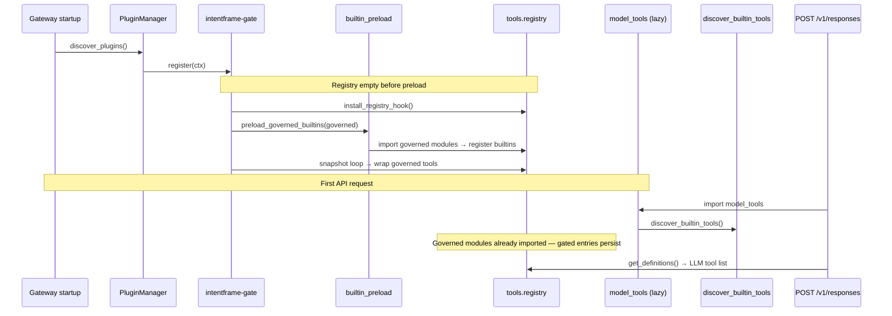
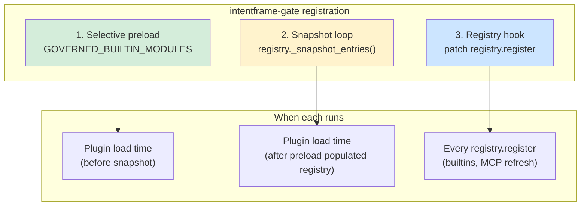
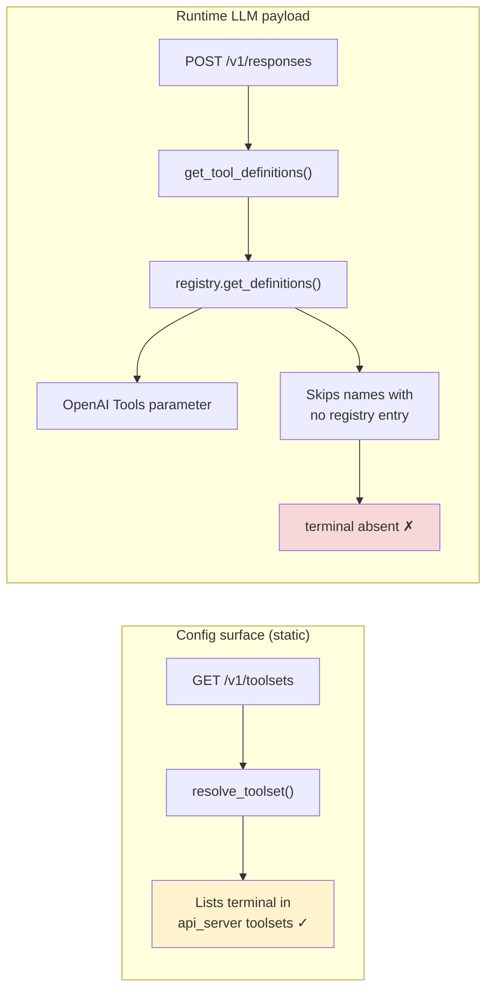
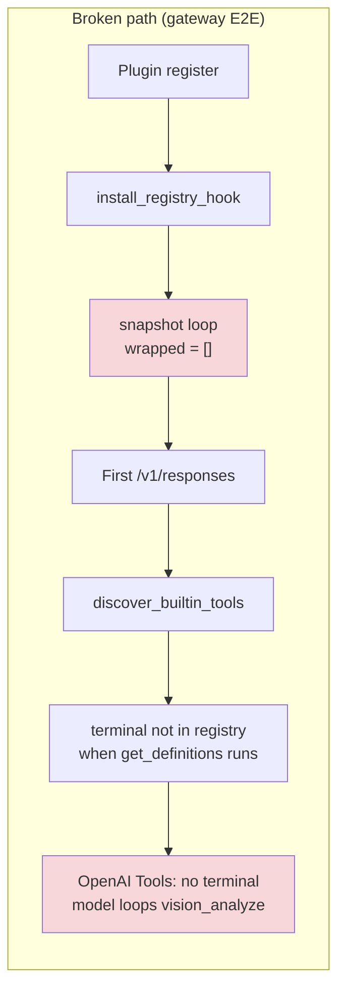
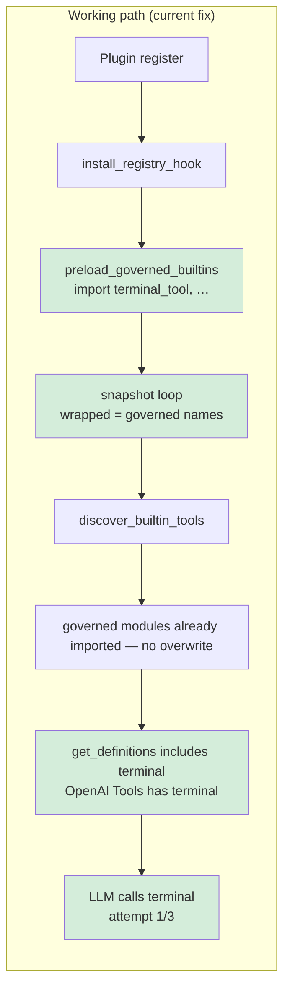

# Hermes plugin registration order (intentframe-gate)

> Why the v1 multi-tool gate regressed on gateway E2E, and why governed builtins need
> **selective module preload** before the generic snapshot wrap at plugin load time.

Related: [`agent-tool-gating.md`](./agent-tool-gating.md),
[`NATIVE_KIT_INTEGRATION.md`](./NATIVE_KIT_INTEGRATION.md),
[`integrations/hermes/plugin/intentframe-gate/`](../integrations/hermes/plugin/intentframe-gate/),
[`integrations/hermes/plugin/intentframe-gate/README.md`](../integrations/hermes/plugin/intentframe-gate/README.md).

---

## TL;DR

| Question | Answer |
|----------|--------|
| What broke? | Replacing `intentframe-terminal` with snapshot + hook only — no preload before snapshot. |
| Why? | Hermes loads **plugins before builtin tools**. The snapshot loop saw an **empty registry**; `terminal` never landed in the live registry before `get_definitions()` built the OpenAI payload. |
| Symptom | **`terminal` was not sent to the LLM at all** (OpenAI trace Tools list has no `terminal`). Model called `vision_analyze` in a loop — it could not comply. |
| Fix | **`preload_governed_builtins(governed)`** then generic snapshot loop with `ctx.register_tool(..., override=True)` for each governed name. See [`builtin_preload.py`](../integrations/hermes/plugin/intentframe-gate/builtin_preload.py). |
| Not the cause | Wrong yaml, reason wording, or LLM flakiness (same model + Hermes passed on old plugin). **`/v1/toolsets` showing `terminal` is not proof the LLM received it.** |
| Avoid | Full `discover_builtin_tools()` in the plugin — side effects like `read_terminal` break the toolsets contract. |

---

## Hermes gateway startup timeline

On gateway startup, plugin discovery runs **before** builtin tool modules import.
Builtin tools register later, when `model_tools` is first imported (typically on
the first `/v1/responses` request).



Hermes documents this ordering in gateway startup: plugins are discovered explicitly
because the `discover_plugins()` side-effect inside `model_tools.py` is **not**
guaranteed to have run before the gateway handles requests.

---

## Three registration mechanisms

The shipped plugin combines three mechanisms. Snapshot + hook alone is **not**
enough on the gateway path — governed Hermes builtins must be preloaded first.



| Mechanism | Purpose | Works when |
|-----------|---------|------------|
| **Selective preload** | Import only Hermes modules for **governed** tool names before snapshot | Always on gateway — populates registry without full `discover_builtin_tools()` |
| **Snapshot loop** | Wrap governed tools already in registry with gated schema + handler | After preload (gateway) or when builtins loaded first (some CLI paths) |
| **Registry hook** | Gate tools registered later (MCP refresh, late imports) | Complement — must not be the **only** path for governed builtins on gateway |

**Why not full `discover_builtin_tools()`?** It imports every builtin module.
That pulled in `read_terminal`, which Hermes then merged into the `terminal` toolset
and broke the E2E toolsets contract (`['process', 'terminal']` expected). Selective
preload imports only modules listed in `GOVERNED_BUILTIN_MODULES` for names in the
runtime governed set.

---

## Config surface vs what the LLM actually receives

The strongest evidence is an **OpenAI official trace** from a failing E2E run
(sandbox `hg0b3c490c`, 23 Jun 2026). The user prompt and system instructions both
say “call the **terminal** tool exactly once”, but the **Tools** block on the
Chat Completion request lists **15 functions — and `terminal` is not among them**:

| In OpenAI request Tools | Missing from OpenAI Tools |
|-------------------------|---------------------------|
| `cronjob`, `delegate_task`, `execute_code`, `image_generate`, `memory`, `patch`, `read_file`, `search_files`, `session_search`, `skill_manage`, `skill_view`, `skills_list`, `todo`, `vision_analyze`, `write_file` | **`terminal`**, **`process`**, all browser tools, `web_search`, `web_extract`, … |

The model then called `vision_analyze` repeatedly, passing the `printf '…'` marker
string as `image_url` — because **`terminal` was not callable**. This is not the
model “choosing the wrong tool”; it **never had `terminal` in its tool schema**.

Meanwhile, the same E2E run’s `GET /v1/toolsets` reported **31 enabled tools**
including `terminal` and `process`. Those endpoints answer different questions:



Hermes builds the OpenAI tool list via
[`registry.get_definitions()`](../external-reference-only-libs/hermes-agent/tools/registry.py):
for each requested tool name, if there is **no registry entry**, it is **silently
skipped** (`if not entry: continue`). No error is raised; the tool simply never
reaches the model.

[`model_tools.py`](../external-reference-only-libs/hermes-agent/model_tools.py) documents
this explicitly: “Ask the registry for schemas (**only returns tools whose check_fn
passes**)”. [`GET /v1/toolsets`](../external-reference-only-libs/hermes-agent/gateway/platforms/api_server.py)
uses static `resolve_toolset()` — it does **not** call `get_definitions()`.

**Takeaway:** a passing `/v1/toolsets` snapshot does **not** prove `terminal` is in
the OpenAI request. Verify the live payload (OpenAI trace, or gateway logs showing
`Loaded N tools: …` in agent init).

---

## Broken design (regression)

The first v1 refactor assumed snapshot + hook could replace the old
`intentframe-terminal` one-liner (which effectively preloaded `terminal_tool`).



### Runtime evidence (pre-fix)

Debug instrumentation during a failing run showed:

| Signal | Value |
|--------|-------|
| `wrapped` | `[]` |
| `terminal_in_registry` at plugin register | `false` |
| Governance yaml | Correct — only `terminal` |
| `inject_reason` / schema | `required: ["command", "reason"]` when hook fired later |
| `GET /v1/toolsets` | `terminal` listed among 31 enabled tools (**config only**) |
| **OpenAI trace Tools** | **15 tools — `terminal` and `process` absent** |
| ALLOW probe | `tool_calls: ["vision_analyze", …]`, `has_terminal: false` |

The failure was **not** wrong yaml or reason wording. **`terminal` was advertised in
toolsets config but dropped from the runtime registry path that builds the OpenAI
Tools list** — so the model could not call it.

---

## Working design (old plugin + current fix)

### What `intentframe-terminal` did (historical)

At plugin load it imported `tools.terminal_tool` via `build_terminal_schema()` and
registered a gated override — same **early import + wrap** effect as preload today.

### Current fix: selective preload + generic snapshot

[`__init__.py`](../integrations/hermes/plugin/intentframe-gate/__init__.py):

```python
install_registry_hook()
governed = governed_tool_names()
preload_governed_builtins(governed)   # GOVERNED_BUILTIN_MODULES

for entry in registry._snapshot_entries():
    if entry.name not in governed:
        continue
    ctx.register_tool(
        name=entry.name,
        schema=inject_reason(entry.schema, tool_name=entry.name),
        handler=wrap_handler(...),
        override=True,
        ...
    )
```

That path:

1. Imports only Hermes modules needed for **governed** names (see
   [`builtin_preload.py`](../integrations/hermes/plugin/intentframe-gate/builtin_preload.py)).
2. Populates the registry **before** the snapshot loop runs.
3. Wraps each governed entry generically — no terminal-specific branch in `register()`.
4. When `discover_builtin_tools()` runs later, governed modules are already imported —
   module-level `registry.register(...)` does **not** run again, so gated entries persist.



### Runtime evidence (post-fix)

After adding selective preload (branch `fix-plugin-new-mechanism`, 23 Jun 2026):

| Signal | Value |
|--------|-------|
| `wrapped` | `["terminal"]` when only `terminal` governed |
| `terminal_in_registry` at plugin register | `true` |
| `GET /v1/toolsets` | `terminal: ['process', 'terminal']` — no `read_terminal` leak |
| ALLOW probe | `tool_calls: ["terminal"]`, `has_terminal: true` on attempt 1/3 |
| E2E | Passed pass 1, 2a, 2b |

Unit tests: [`tests/hermes_plugin/test_builtin_preload.py`](../tests/hermes_plugin/test_builtin_preload.py).

---

## Side-by-side: old vs broken vs fixed

```
┌─────────────────────────────────────────────────────────────────────────────┐
│                        HERMES GATEWAY STARTUP ORDER                           │
├─────────────────────────────────────────────────────────────────────────────┤
│  1. discover_plugins()          ← intentframe-gate register() runs HERE     │
│  2. (hooks, relay, …)                                                       │
│  3. first /v1/responses         ← model_tools + discover_builtin_tools()    │
└─────────────────────────────────────────────────────────────────────────────┘

  intentframe-terminal (old)     intentframe-gate (broken)    intentframe-gate (fixed)
  ──────────────────────────     ─────────────────────────    ─────────────────────────
  register():                    register():                  register():
    import terminal_tool           hook only                    hook
    ctx.register_tool ✓            snapshot → empty ✗           preload governed modules ✓
                                   wrapped = []                 snapshot wrap governed ✓
  discover_builtin_tools():      discover_builtin_tools():    discover_builtin_tools():
    terminal_tool already          terminal not in registry     governed modules already
    imported — no overwrite        at get_definitions time      imported — no overwrite
  OpenAI Tools: has terminal     OpenAI Tools: NO terminal    OpenAI Tools: has terminal
  E2E: ALLOW attempt 1/3 ✓       E2E: fails all 3 attempts ✗  E2E: ALLOW attempt 1/3 ✓
```

---

## Current plugin layout

[`integrations/hermes/plugin/intentframe-gate/__init__.py`](../integrations/hermes/plugin/intentframe-gate/__init__.py):

1. **`install_registry_hook()`** — gate future `registry.register` calls (MCP refresh).
2. **`preload_governed_builtins(governed)`** — import governed Hermes builtin modules
   before snapshot (gateway load-order fix).
3. **Snapshot loop** — generic wrap for all governed names with `override=True`.

| File | Role |
|------|------|
| [`builtin_preload.py`](../integrations/hermes/plugin/intentframe-gate/builtin_preload.py) | `GOVERNED_BUILTIN_MODULES` map + selective `importlib.import_module` |
| [`schema.py`](../integrations/hermes/plugin/intentframe-gate/schema.py) | `inject_reason()` — terminal-specific reason text branch |
| [`gate.py`](../integrations/hermes/plugin/intentframe-gate/gate.py) | Validate via adapter, strip `reason`, delegate |
| [`registry_hook.py`](../integrations/hermes/plugin/intentframe-gate/registry_hook.py) | Patch `registry.register` for dynamic tools |

When adding a governed Hermes **builtin**, add its import module to
`GOVERNED_BUILTIN_MODULES` (see [`test_builtin_preload.py`](../tests/hermes_plugin/test_builtin_preload.py)).

---

## Implications for other governed tools

| Tool | Gateway E2E | Registration note |
|------|-------------|-------------------|
| `terminal`, `process`, `write_file`, `patch` | Probed when in scoped yaml | Listed in `GOVERNED_BUILTIN_MODULES` — preload + snapshot |
| `delete_file` | Probed when in scoped yaml | No Hermes 0.17 standalone import module — rely on hook / MCP path |

If a governed tool fails with “model never calls tool X”:

1. Check an **OpenAI trace** (or agent init logs) — is X in the **Tools** parameter?
2. If X is on `/v1/toolsets` but **not** in the OpenAI Tools list, the registry /
   `get_definitions()` path dropped it (missing entry or failed `check_fn`).
3. Check plugin register logs for `wrapped` — empty means preload map may be missing X.
4. Add X to `GOVERNED_BUILTIN_MODULES` if Hermes registers it at module import time.

**Hermes-native long-term fix:** gateway could call `discover_builtin_tools()` before
`discover_plugins()` (upstream). Until then, the plugin owns selective preload.

---

## Verification

```bash
# Terminal-only scope (fastest repro)
HERMES_E2E_GOVERNED_TOOLS=terminal RUN_HERMES_GATEWAY_E2E=1 \
  ./tests/scripts/test-hermes-gateway-e2e.sh
```

Expect:

- `GET /v1/toolsets` — `terminal: ['process', 'terminal']` (no `read_terminal`)
- `POST /v1/responses ALLOW (attempt 1/3)` on passes 1, 2a, 2b
- `Hermes gateway E2E passed (pass 1, 2a, 2b)`

See also: [`tests/hermes_gateway/README.md`](../tests/hermes_gateway/README.md).

Compare with bisect: checkout commit before `intentframe-gate` refactor
(`intentframe-terminal` only) — same model and Hermes version should also pass
attempt 1/3; that isolates the regression to plugin registration, not the LLM.

---

## References

- Plugin README: [`integrations/hermes/plugin/intentframe-gate/README.md`](../integrations/hermes/plugin/intentframe-gate/README.md)
- Gating overview: [`docs/agent-tool-gating.md`](./agent-tool-gating.md)
- E2E harness: [`tests/hermes_gateway/`](../tests/hermes_gateway/),
  [`tests/scripts/test-hermes-gateway-e2e.sh`](../tests/scripts/test-hermes-gateway-e2e.sh)
- Preload unit tests: [`tests/hermes_plugin/test_builtin_preload.py`](../tests/hermes_plugin/test_builtin_preload.py)
- Hermes gateway plugin discovery:
  [`gateway/run.py`](../external-reference-only-libs/hermes-agent/gateway/run.py)
  (explicit `discover_plugins()` before lazy `model_tools`)
- Hermes tool discovery order:
  [`model_tools.py`](../external-reference-only-libs/hermes-agent/model_tools.py)
  (`discover_builtin_tools()` then `discover_plugins()` on import — but gateway
  may call plugins first)
- Registry definition filter (silent skip):
  [`tools/registry.py`](../external-reference-only-libs/hermes-agent/tools/registry.py)
  (`get_definitions()` — no entry → tool omitted from LLM payload)
- Static toolsets endpoint (not the LLM payload):
  [`gateway/platforms/api_server.py`](../external-reference-only-libs/hermes-agent/gateway/platforms/api_server.py)
  (`GET /v1/toolsets` → `resolve_toolset()`)
- Debug session notes:
  [`.claude_chats/23_june_2026_debug-hermes-e2e-test-failures-and-plugin-integration_6ee02e88.md`](../.claude_chats/23_june_2026_debug-hermes-e2e-test-failures-and-plugin-integration_6ee02e88.md)
