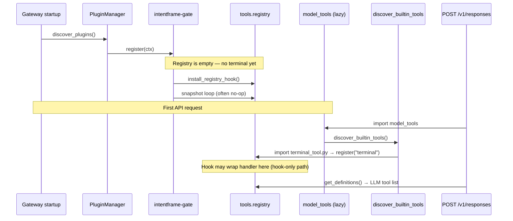
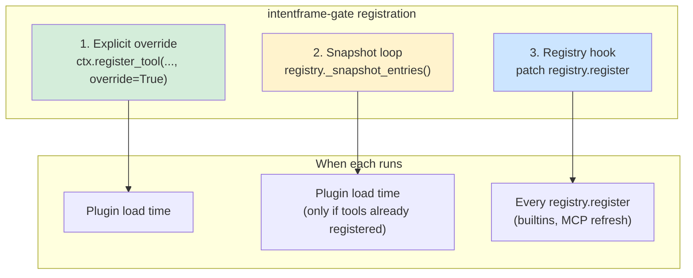
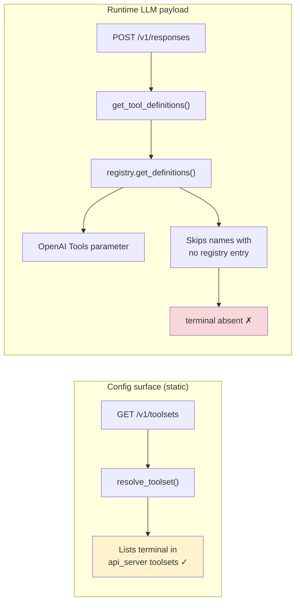
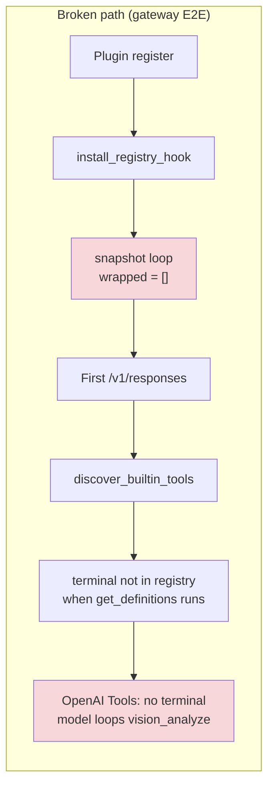
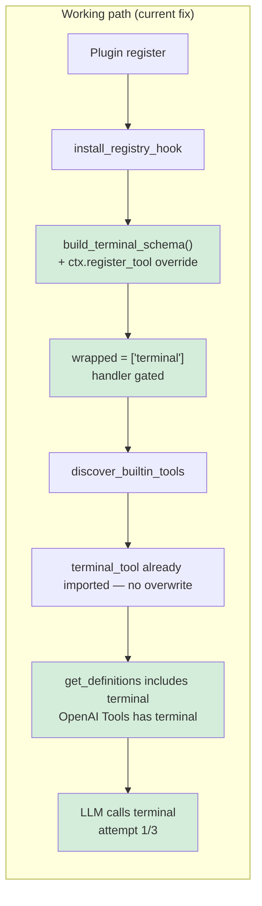

# Hermes plugin registration order (intentframe-gate)

> Why the v1 multi-tool gate regressed on gateway E2E, and why `terminal` needs an
> explicit `ctx.register_tool(..., override=True)` at plugin load time.

Related: [`agent-tool-gating.md`](./agent-tool-gating.md),
[`NATIVE_KIT_INTEGRATION.md`](./NATIVE_KIT_INTEGRATION.md),
[`integrations/hermes/plugin/intentframe-gate/`](../integrations/hermes/plugin/intentframe-gate/).

---

## TL;DR

| Question | Answer |
|----------|--------|
| What broke? | Replacing `intentframe-terminal` with snapshot + hook only — no explicit terminal override at plugin load. |
| Why? | Hermes loads **plugins before builtin tools**. The snapshot loop saw an **empty registry**; `terminal` never landed in the live registry before `get_definitions()` built the OpenAI payload. |
| Symptom | **`terminal` was not sent to the LLM at all** (OpenAI trace Tools list has no `terminal`). Model called `vision_analyze` in a loop — it could not comply. |
| Fix | Restore the old path: `build_terminal_schema()` + `ctx.register_tool(..., override=True)` for `terminal` in `__init__.py`. |
| Not the cause | Wrong yaml, reason wording, or LLM flakiness (same model + Hermes passed on old plugin). **`/v1/toolsets` showing `terminal` is not proof the LLM received it.** |

---

## Hermes gateway startup timeline

On gateway startup, plugin discovery runs **before** builtin tool modules import.
Builtin tools register later, when `model_tools` is first imported (typically on
the first `/v1/responses` request).



Hermes documents this ordering in gateway startup: plugins are discovered explicitly
because the `discover_plugins()` side-effect inside `model_tools.py` is **not**
guaranteed to have run before the gateway handles requests.

---

## Three registration mechanisms

The shipped plugin combines three mechanisms. They are **not** interchangeable for
`terminal`.



| Mechanism | Purpose | Works when |
|-----------|---------|------------|
| **Explicit override** | Replace a builtin with gated schema + handler at plugin load | Always for `terminal` (proven E2E path) |
| **Snapshot loop** | Wrap tools already in registry when plugin loads | Plugin runs **after** builtins (CLI path) or second plugin load |
| **Registry hook** | Gate tools registered later (MCP refresh, late imports) | Complement — must not be the **only** path for `terminal` on gateway |

---

## Config surface vs what the LLM actually receives

The strongest evidence is an **OpenAI official trace** from a failing E2E run
(sandbox `hg0b3c490c`, 23 Jun 2026). The user prompt and system instructions both
say “call the **terminal** tool exactly once”, but the **Tools** block on the
Chat Completion request lists **15 functions — and `terminal` is not among them**:

| In OpenAI request Tools | Missing from OpenAI Tools |
|-------------------------|---------------------------|
| `cronjob`, `delegate_task`, `execute_code`, `image_generate`, `memory`, `patch`, `read_file`, `search_files`, `session_search`, `skill_manage`, `skill_view`, `skills_list`, `todo`, `vision_analyze`, `write_file` | **`terminal`**, **`process`**, all browser tools, `web_search`, `web_extract`, … |

The model then called `vision_analyze` repeatedly, passing the `printf '…'` marker
string as `image_url` — because **`terminal` was not callable**. This is not the
model “choosing the wrong tool”; it **never had `terminal` in its tool schema**.

Meanwhile, the same E2E run’s `GET /v1/toolsets` reported **31 enabled tools**
including `terminal` and `process`. Those endpoints answer different questions:



Hermes builds the OpenAI tool list via
[`registry.get_definitions()`](../external-reference-only-libs/hermes-agent/tools/registry.py):
for each requested tool name, if there is **no registry entry**, it is **silently
skipped** (`if not entry: continue`). No error is raised; the tool simply never
reaches the model.

[`model_tools.py`](../external-reference-only-libs/hermes-agent/model_tools.py) documents
this explicitly: “Ask the registry for schemas (**only returns tools whose check_fn
passes**)”. [`GET /v1/toolsets`](../external-reference-only-libs/hermes-agent/gateway/platforms/api_server.py)
uses static `resolve_toolset()` — it does **not** call `get_definitions()`.

**Takeaway:** a passing `/v1/toolsets` snapshot does **not** prove `terminal` is in
the OpenAI request. Verify the live payload (OpenAI trace, or gateway logs showing
`Loaded N tools: …` in agent init).

---

## Broken design (regression)

The first v1 refactor assumed snapshot + hook could replace the old
`intentframe-terminal` one-liner.



### Runtime evidence (pre-fix)

Debug instrumentation during a failing run showed:

| Signal | Value |
|--------|-------|
| `wrapped` | `[]` |
| `terminal_in_registry` at plugin register | `false` |
| Governance yaml | Correct — only `terminal` |
| `inject_reason` / schema | `required: ["command", "reason"]` when hook fired later |
| `GET /v1/toolsets` | `terminal` listed among 31 enabled tools (**config only**) |
| **OpenAI trace Tools** | **15 tools — `terminal` and `process` absent** |
| ALLOW probe | `tool_calls: ["vision_analyze", …]`, `has_terminal: false` |

The failure was **not** wrong yaml or reason wording. **`terminal` was advertised in
toolsets config but dropped from the runtime registry path that builds the OpenAI
Tools list** — so the model could not call it.

---

## Working design (old plugin + current fix)

`intentframe-terminal` always did this at plugin load:

```python
schema = build_terminal_schema()   # imports tools.terminal_tool
ctx.register_tool(name="terminal", schema=schema, handler=_handle_terminal,
                  check_fn=..., override=True)
```

That path:

1. Imports `terminal_tool` **early** (side effect: first registry entry).
2. **Replaces** it immediately with the gated schema and handler via `override=True`.
3. When `discover_builtin_tools()` runs later, `terminal_tool` is already imported —
   module-level `registry.register(...)` does **not** run again, so the gated entry persists.



### Runtime evidence (post-fix)

After restoring `_register_terminal_override()` in
[`__init__.py`](../integrations/hermes/plugin/intentframe-gate/__init__.py):

| Signal | Value |
|--------|-------|
| `terminal_explicit` | `true` |
| `wrapped` | `["terminal"]` |
| `terminal_in_registry` | `true` |
| `terminal_handler_gated` | `true` |
| ALLOW probe | `tool_calls: ["terminal"]`, `has_terminal: true` on attempt 1/3 |
| E2E | Passed pass 1, 2a, 2b |

---

## Side-by-side: old vs broken vs fixed

```
┌─────────────────────────────────────────────────────────────────────────────┐
│                        HERMES GATEWAY STARTUP ORDER                           │
├─────────────────────────────────────────────────────────────────────────────┤
│  1. discover_plugins()          ← intentframe-gate register() runs HERE     │
│  2. (hooks, relay, …)                                                       │
│  3. first /v1/responses         ← model_tools + discover_builtin_tools()    │
└─────────────────────────────────────────────────────────────────────────────┘

  intentframe-terminal (old)     intentframe-gate (broken)    intentframe-gate (fixed)
  ──────────────────────────     ─────────────────────────    ─────────────────────────
  register():                    register():                  register():
    build_terminal_schema()        hook only                    hook
    ctx.register_tool ✓            snapshot → empty ✗           explicit terminal ✓
                                   wrapped = []                 snapshot (other tools)
  discover_builtin_tools():      discover_builtin_tools():    discover_builtin_tools():
    terminal_tool already          terminal not in registry     terminal_tool already
    imported — no overwrite        at get_definitions time      imported — no overwrite
  OpenAI Tools: has terminal     OpenAI Tools: NO terminal    OpenAI Tools: has terminal
  E2E: ALLOW attempt 1/3 ✓       E2E: fails all 3 attempts ✗  E2E: ALLOW attempt 1/3 ✓
```

---

## Current plugin layout

[`integrations/hermes/plugin/intentframe-gate/__init__.py`](../integrations/hermes/plugin/intentframe-gate/__init__.py):

1. **`install_registry_hook()`** — gate future `registry.register` calls (MCP refresh).
2. **`_register_terminal_override(ctx)`** — when `terminal` is governed, explicit
   `ctx.register_tool(..., override=True)` (same contract as old `intentframe-terminal`).
3. **Snapshot loop** — for other governed tools already in the registry (e.g. CLI
   paths where builtins loaded first).

Other files unchanged in role:

| File | Role |
|------|------|
| [`schema.py`](../integrations/hermes/plugin/intentframe-gate/schema.py) | `build_terminal_schema()` for terminal; `inject_reason()` for other tools |
| [`gate.py`](../integrations/hermes/plugin/intentframe-gate/gate.py) | Validate via adapter, strip `reason`, delegate |
| [`registry_hook.py`](../integrations/hermes/plugin/intentframe-gate/registry_hook.py) | Patch `registry.register` for dynamic tools |

---

## Implications for other governed tools

| Tool | Gateway E2E today | Registration note |
|------|-------------------|-------------------|
| `terminal` | Required explicit override | **Must** use `_register_terminal_override` — do not rely on snapshot + hook alone |
| `process`, `write_file`, `patch`, `delete_file` | Probed when in scoped yaml | Snapshot + hook usually sufficient once builtins load; watch for same load-order gap if E2E flakes |

If a non-terminal governed tool fails with “model never calls tool X”:

1. Check an **OpenAI trace** (or agent init logs) — is X in the **Tools** parameter?
2. If X is on `/v1/toolsets` but **not** in the OpenAI Tools list, the registry /
   `get_definitions()` path dropped it (missing entry or failed `check_fn`).
3. Check plugin register logs for `wrapped` and consider an explicit
   `ctx.register_tool(..., override=True)` for that tool name (same pattern as
   `terminal`).

---

## Verification

```bash
# Terminal-only scope (fastest repro)
HERMES_E2E_GOVERNED_TOOLS=terminal RUN_HERMES_GATEWAY_E2E=1 \
  ./tests/scripts/test-hermes-gateway-e2e.sh
```

Expect:

- `POST /v1/responses ALLOW (attempt 1/3)` on passes 1, 2a, 2b
- `Hermes gateway E2E passed (pass 1, 2a, 2b)`

Compare with bisect: checkout commit before `intentframe-gate` refactor
(`intentframe-terminal` only) — same model and Hermes version should also pass
attempt 1/3; that isolates the regression to plugin registration, not the LLM.

---

## References

- Plugin: [`integrations/hermes/plugin/intentframe-gate/`](../integrations/hermes/plugin/intentframe-gate/)
- E2E harness: [`tests/hermes_gateway/`](../tests/hermes_gateway/),
  [`tests/scripts/test-hermes-gateway-e2e.sh`](../tests/scripts/test-hermes-gateway-e2e.sh)
- Hermes gateway plugin discovery:
  [`gateway/run.py`](../external-reference-only-libs/hermes-agent/gateway/run.py)
  (explicit `discover_plugins()` before lazy `model_tools`)
- Hermes tool discovery order:
  [`model_tools.py`](../external-reference-only-libs/hermes-agent/model_tools.py)
  (`discover_builtin_tools()` then `discover_plugins()` on import — but gateway
  may call plugins first)
- Registry definition filter (silent skip):
  [`tools/registry.py`](../external-reference-only-libs/hermes-agent/tools/registry.py)
  (`get_definitions()` — no entry → tool omitted from LLM payload)
- Static toolsets endpoint (not the LLM payload):
  [`gateway/platforms/api_server.py`](../external-reference-only-libs/hermes-agent/gateway/platforms/api_server.py)
  (`GET /v1/toolsets` → `resolve_toolset()`)
- Debug session notes:
  [`.claude_chats/23_june_2026_debug-hermes-e2e-test-failures-and-plugin-integration_6ee02e88.md`](../.claude_chats/23_june_2026_debug-hermes-e2e-test-failures-and-plugin-integration_6ee02e88.md)
